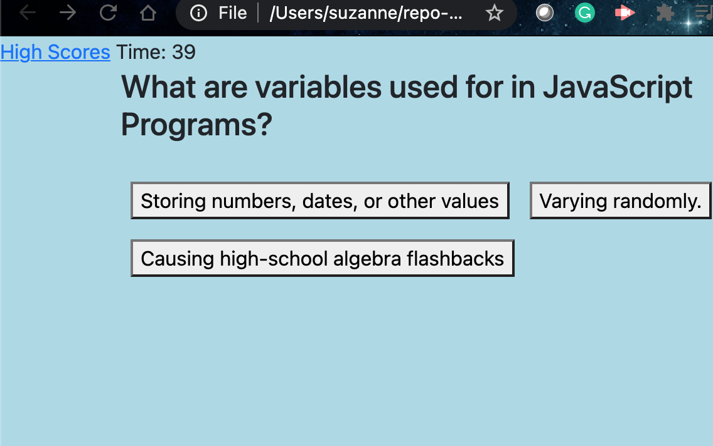
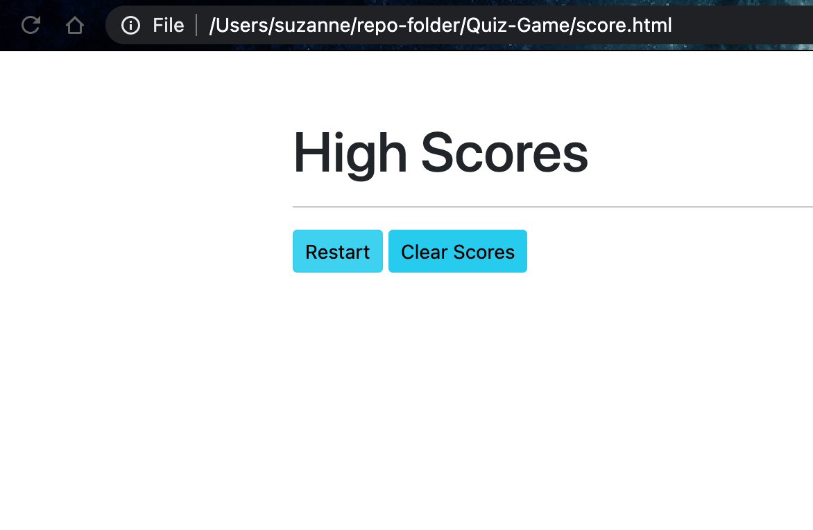

# Quiz-Game

## Objective 
To create a quiz that is interactive.
Correct responses add 10 seconds to the timer, incorrect responses subtracts 10 seconds from the timer. At the end of the quiz the user is able to save his/her initials and score, then restart the game or clear the highscore. User can also view highscores.

## Technologies Used:
1. HTML
2. CSS
3. Javascript
4. Bootstrap

## Screenhoots of application
#### Front page
The start page of the quiz with instructions 

#### Question example
One of ten questions, with timer running

#### Restart/Highscore
At the end of the quiz the user and store their score and initials, then restart the quiz

## View deployed application
* https://srad25.github.io/Quiz-Game/
* https://github.com/srad25/Quiz-Game

## Contact 
* [srad25](https://www.github.com/srad25)

