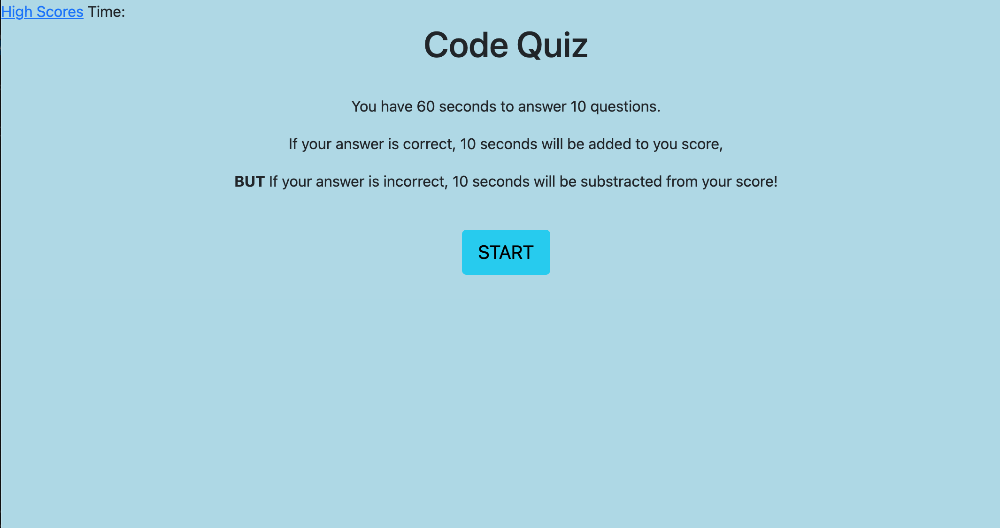

# Quiz-Game
Objective is to create a quiz that is interactive.
Correct responses add 10 seconds to the timer, incorrect responses subtracts 10 seconds from the timer. At the end of the quiz the user is able to save his/her initials and score, then resets the game. User can also view highscores.

https://srad25.github.io/Quiz-Game/

